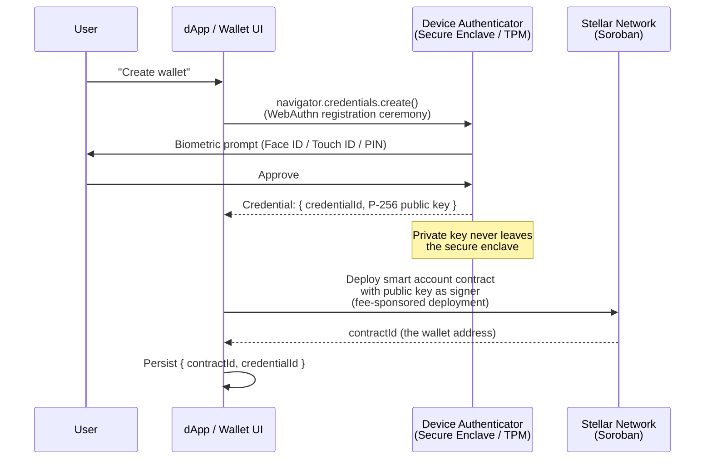
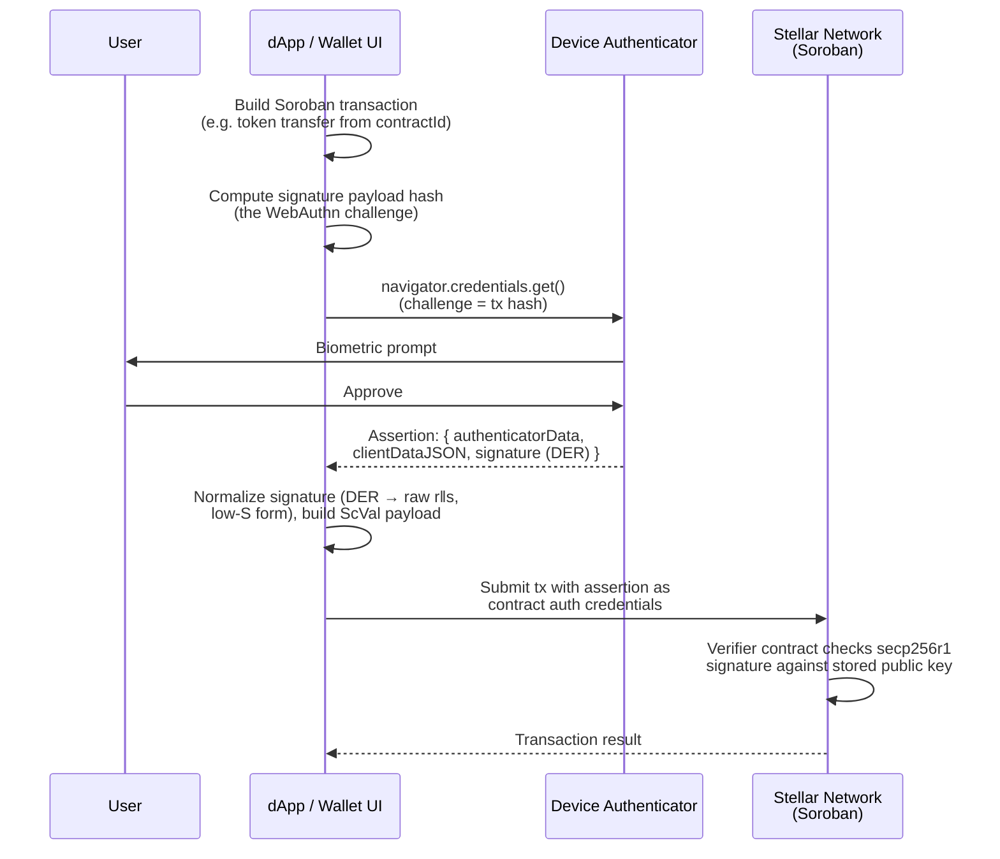
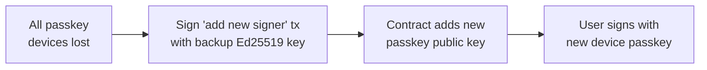
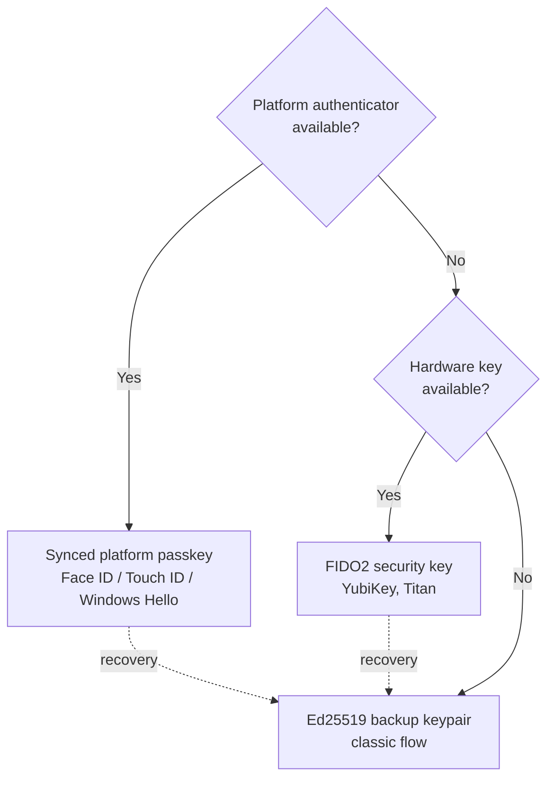
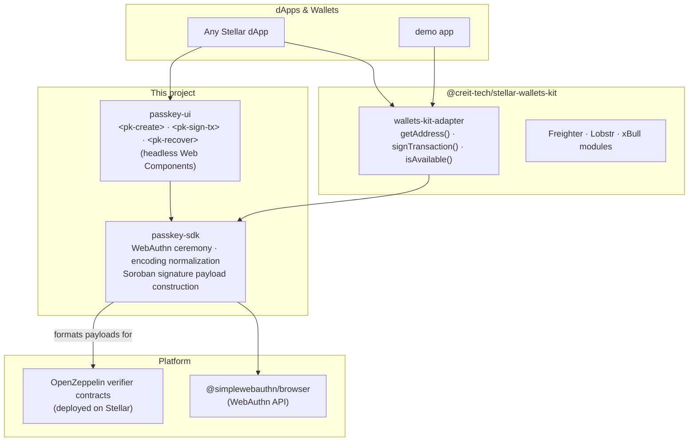

# Architecture: Passkeys on Stellar

How passkey-secured smart accounts work on Stellar, the design considerations driving our choices, and the architecture and requirements for the SDK we are building.

Related docs: [compatibility-matrix.md](./compatibility-matrix.md) · [usage-patterns.md](./usage-patterns.md) · [passkey-storage-and-sync.md](./passkey-storage-and-sync.md)

---

## 1. How Passkeys Work on Stellar

### The Core Idea

On Stellar, a passkey wallet is **a Soroban smart contract, not a keypair**. The contract holds a list of authorized signers; one of them is a P-256 (secp256r1) public key generated by the user's device authenticator. Protocol 21 (CAP-0051) added native secp256r1 verification inside Soroban, so the passkey assertion is verified on-chain with no bridge or intermediary.

```
User's Wallet = Soroban Smart Contract
  ├── Signer 1: Passkey (P-256 public key from device authenticator)
  ├── Signer 2: Backup Ed25519 keypair (recovery)
  └── Signer N: Additional passkeys, session keys, policies...
```

### Registration (Wallet Creation)



Key points:

- The **private key never leaves the device**. Only the public key goes on-chain.
- The contract address (`contractId`) is derived deterministically from the deployer and salt; the app must persist the `credentialId → contractId` mapping because WebAuthn gives back only the credentialId at sign-in time.
- Deployment fees are paid by a **sponsor account**, so the user starts with zero XLM.

### Transaction Signing



The verification on-chain re-derives what the authenticator signed: `sha256(authenticatorData ‖ sha256(clientDataJSON))`, where `clientDataJSON` embeds the challenge (the transaction's signature payload hash). This binds the biometric approval to that exact transaction.

### Recovery

Passkeys can be lost (device-bound key on a broken laptop, abandoned Apple/Google account). The smart account holds a **backup Ed25519 signer** added at creation time. Recovery is a normal contract invocation signed by the backup key that rotates in a new passkey signer:



---

## 2. Design Considerations

### Synced vs. Device-Bound Passkeys

This single distinction drives most UX and recovery decisions:

| | Synced passkey | Device-bound passkey |
|---|---|---|
| Stored in | iCloud Keychain / Google Password Manager | Secure Enclave / TPM / YubiKey |
| Survives device loss | ✅ (any device on same account) | ❌ (gone with the device) |
| Typical user | Consumers | Security keys, enterprise |

Most consumer passkeys are synced, so the common case is good. But the SDK must treat device-bound credentials as first-class (Firefox, Linux, hardware keys) and always push apps to register a backup signer.

### Platform Fragmentation

From [compatibility-matrix.md](./compatibility-matrix.md), tested on real devices:

- **Chrome / Safari / Edge** on macOS, iOS, Android, Windows: full support, synced.
- **Firefox**: works but credentials are device-local with no sync; conditional UI only on 119+.
- **Signature encoding differs**: authenticators return DER-encoded signatures; some produce high-S values that on-chain verifiers reject. The SDK must normalize to raw `r‖s` low-S form.
- **`credentialId` encoding** (base64 vs base64url) differs across libraries and must be normalized at every boundary.

Fallback ladder we recommend to integrators:



### The credentialId → contractId Mapping

WebAuthn authentication returns only a `credentialId`. The contract address must be looked up, not derived on the fly, because derivation depends on the deployer key and salt used at creation. Lessons from the portal demo:

- Persist `{ contractId, credentialId }` locally at creation time and treat it as the source of truth.
- Always pass both IDs explicitly when connecting; never rely on re-derivation, which silently breaks if the deployer configuration changes.
- For multi-device sign-in (synced passkey, new device), the mapping must come from somewhere durable: an indexer, a registry contract, or a service. This is a core SDK requirement, not an app afterthought.

### Fee Sponsorship

Users start with zero XLM, so both deployment and early transactions need a sponsor:

- The sponsor key signs as the **fee source**, while the passkey authorizes the **operation** via contract auth. The two roles must stay decoupled in the SDK API.
- Launchtube and similar services exist for this; the SDK should accept any fee-bump strategy rather than hard-coding one.

### Security Posture

- The SDK **does not touch or modify the on-chain verifier contracts** (OpenZeppelin stellar-contracts: deployed, partially audited). It only formats WebAuthn output into the payload the verifier expects, so no new attack surface is introduced at the contract level.
- Passkeys are **origin-bound**: a credential created on `wallet.example.com` cannot be exercised by a phishing site. The flip side: the relying party ID is part of the credential, so domain migrations need explicit planning.
- Challenges must be the actual transaction signature payload hash, never a static or reused value, to prevent replay.

### Native Mobile

Native iOS (`ASAuthorizationController`) and Android (`CredentialManager`) produce assertions structurally identical to browser WebAuthn output and work against the same verifier contract. The browser SDK stays web-only; the compatibility docs carry a native bridge section covering formatting differences for React Native, Flutter, Swift, and Kotlin.

---

## 3. SDK Architecture

The ecosystem has the hard parts solved at the contract level ([OpenZeppelin stellar-contracts](https://github.com/OpenZeppelin/stellar-contracts)) and at the full-featured SDK level ([smart-account-kit](https://github.com/kalepail/smart-account-kit)). What's missing is the minimal, approachable middle layer. We use smart-account-kit as a **reference implementation**, extracting the minimum viable WebAuthn and Soroban payload logic into a new standalone SDK, and build on the already-deployed OpenZeppelin contracts rather than reinventing the on-chain layer.



### `passkey-sdk` (core)

The thin core layer. Wraps `@simplewebauthn/browser` for registration and authentication, normalizes encoding differences between Chrome, Safari, and Firefox (DER → raw signatures, low-S normalization, base64url credential IDs), and constructs the Soroban `ScVal` signature payload the verifier contract expects. Narrow API surface:

```typescript
browserCapabilities()                    // feature-detect before showing passkey UI
createWallet(name)                       // WebAuthn registration + contract deployment
signTransaction(tx, credentialId)        // WebAuthn assertion + payload construction
addBackupSigner(contractId, publicKey)   // register Ed25519 recovery signer
signWithBackup(tx, keypair)              // recovery-path signing
```

### `passkey-ui` (components)

Three headless Web Components, one per core flow: `<pk-create>`, `<pk-sign-tx>`, `<pk-recover>`. Each manages the WebAuthn ceremony and emits typed events on completion, with zero opinion on visual styling. For `<pk-sign-tx>`, the developer owns the transaction summary view (what the user sees before confirming); the component handles only the signing ceremony underneath. A single build works in React, Vue, Svelte, and vanilla JS without adapter shims.

### `wallets-kit-adapter` (connector)

Implements the `IStellarWalletsKit` module interface so passkeys appear as a native wallet option alongside Freighter, Lobstr, and xBull. Any dApp already using stellar-wallets-kit adds passkey support by registering the adapter; their signing flow doesn't change. Target: a PR into the official repo.

### `demo`

Exercises the full flow end to end through the adapter: create (`<pk-create>`), sign a Soroban transaction (`<pk-sign-tx>`), recover via backup key (`<pk-recover>`). Lives on Testnet.

### Key Technical Decisions

| Decision | Choice | Reason |
|---|---|---|
| On-chain contracts | OpenZeppelin stellar-contracts | Already deployed, partially audited, modular verifiers |
| WebAuthn library | @simplewebauthn/browser | Smallest proven abstraction; normalizes browser differences |
| UI approach | Headless Web Components | Framework-agnostic with one build; developer owns styling |
| Test framework | Vitest | Fast, native ESM, TypeScript-native |
| License | MIT | Permissive; compatible with downstream wallet integrations |

---

## 4. Requirements

### Functional

| # | Requirement |
|---|---|
| F1 | Create a passkey-secured smart account: WebAuthn registration → contract deployment → return `{ contractId, credentialId }` |
| F2 | Sign any Soroban transaction with a passkey assertion bound to that transaction's signature payload hash |
| F3 | Register and use an Ed25519 backup signer for recovery when all passkey devices are unavailable |
| F4 | Feature-detect capabilities (`webauthn`, platform authenticator, conditional UI) before any passkey UI is shown |
| F5 | Normalize signatures (DER → raw r‖s, low-S) and credential IDs (base64url) across Chrome, Safari, Firefox, and Edge |
| F6 | Support fee-sponsored deployment and transactions, with the sponsor strategy pluggable |
| F7 | Persist and resolve the `credentialId → contractId` mapping; never depend on silent re-derivation |
| F8 | Implement the full `IStellarWalletsKit` module interface (`getAddress`, `signTransaction`, `isAvailable`) |
| F9 | Ship `<pk-create>`, `<pk-sign-tx>`, `<pk-recover>` as headless Web Components emitting typed events |

### Non-Functional

| # | Requirement |
|---|---|
| N1 | **No contract changes**: only format payloads for the deployed OpenZeppelin verifiers; introduce no new on-chain attack surface |
| N2 | **Framework-agnostic UI**: one Web Components build usable from React, Vue, Svelte, and vanilla JS |
| N3 | **Narrow API**: the SDK surface stays small enough to audit in one sitting |
| N4 | **Documented compatibility**: every supported browser/OS/hardware row in the matrix tested on real devices, with `Last tested` dates and a quarterly re-test cadence plus per-major-browser-release updates |
| N5 | **TypeScript-first**: full type coverage, typed component events, Vitest test suite |
| N6 | **MIT licensed**, published to npm |
| N7 | **Maintenance**: out-of-cycle update PRs within two weeks of breaking changes in upstream WebAuthn platform APIs or reference contracts; docs ownership transfers to stellar-wallets-kit maintainers once merged there |
